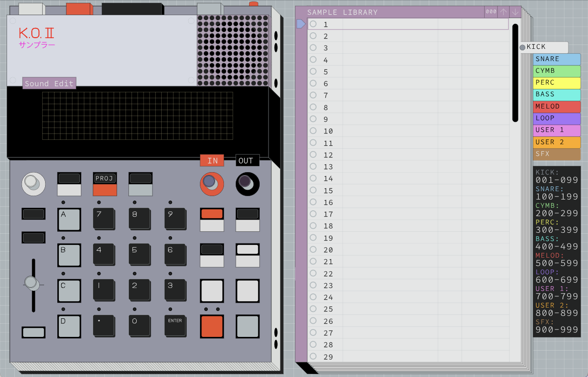

# EP-133 Sample Tool - Offline Version


## Compatability

Any EP-133 or EP-1320 Medieval

## Features

**100% fully offline.** This does not connect to the internet to fetch/cache. All of the web assembly is scraped and included. The original Factory Sound Pack is included in this (which is part of the reason why the executable is over 100MB). Of course, this version will be updated if the original tool is ever updated.

**Option to Backup Projects Only.** The original tool released has a backup tool, which is great but there is one issue: it backs up all sounds and projects. This can be an issue if you have the same base/core sounds you use across all projects. There is a new button in the backup menu to allow you to backup only the projects. This saves a lot of time for backing up/restoring. The project backup feature takes less than a minute to backup. Restoring a backup of projects only will not erase any sounds on your EP-133.

There is a new option in the backup menu for Projects Only:


**Better Zooming and Visibility.** I think the EP-133 sample tool looks aesthetically beautiful. My biggest issue with the original tool is that you cannot zoom in to see better. There are many very small fonts that I simply cannot read. I looked through the css and js to modify the "zoom-in region" to allow you to zoom in to the parts that matter. This allows much better text readability. There are some UI buttons/elements that I have moved to different spots in order to allow zoom-in but still have access to UI buttons.

**Custom Color Schemes and Sound Group Names.** If you build from source, there are several ways to customize this tool to make it look better with your desktop theme. In the `data/custom.js` file, you can edit any color you want. You can also rename the sample groups on the side bar. (I never liked that they have 100 slots for kicks, and 100 slots for snares. I rename mine so kicks and snares are in the same group.)

You can make it look however you would like:


You can set custom names for the sound groups:


**Removed Serial Number.** The original tool shows the serial number of your EP-133 on the main interface. It also shows your serial number in the file name of your backups. Even deeper, the backup file itself has a `meta.json` file inside that also has your serial number inside. This offline version removes all of this. You can create backup files and distribute them without renaming or editing zip/json files.

Your Serial Number is hidden (even in backup file `meta.json`):


**Removed Data Tracker.** All of the data tracking that is sent through the internet has been removed. All tracking data is disabled.

**Debug MIDI-Sysex Messages.** You can open the developer tools in this application and view the raw MIDI-Sysex messages sent to your EP-133. This can be very valuable when trying to reverse engineer how the EP-133 works. In fact, I have done this myself in an attempt to learn how the EP-133 works. I have successfully reverse engineered how the sample tool sends files back and forth. You can send entire sound packs directly to the EP-133 without this tool right now. I just haven't built a nice GUI for this, so for now all of these tools are command-line/terminal only. You can check out my reverse engineering work [here.](https://github.com/garrettjwilke/ep_133_sysex_thingy)

Click on `View > Toggle Developer Tools` to see raw MIDI-SYSEX messages:


---

## Troubleshooting

If you ever have issues with connectivity, refresh the application (click on `View > Reload`).

---

## Download

On the right side of this page is the `Releases` section. You can find this app for Windows, Mac, and Linux.

[OR YOU CAN CLICK HERE](https://github.com/garrettjwilke/ep_133_tool_thingy/releases)

---

## How to build from source

## Requirements

`npm`
`electron`
`electron-builder`

## How to build

after requirements are installed, simply run:
```
npm run package
```

all build files are in the `dist` directory.

## How to run without building

you do not need `electron-builder` to run. all you need is npm and electron installed.
```
npm start
```
